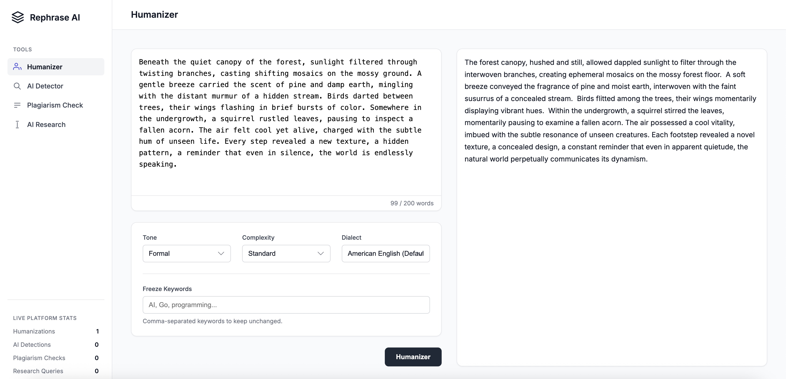

# Rephrase AI – The Professional Writing Suite

Rephrase AI is a modern, web-based text analysis and enhancement suite built with a powerful **Go** backend and a dynamic vanilla JavaScript frontend. It leverages the Google Gemini API to provide a seamless, all-in-one workspace for writers, editors, and content creators to perfect their text.

This project demonstrates the creation of a full-stack, real-time, API-driven application that is both highly functional and aesthetically polished.




---

## ✨ Features

-   **Multi-Tool Dashboard:** A clean, sidebar-based interface to switch between four powerful tools:
    -   **Humanizer:** Rewrites text with granular control over **Tone**, **Complexity**, and **Dialect**. Includes advanced options like **"Freeze Keywords"** to protect important terms.
    -   **AI Detector:** Provides an overall percentage score and **highlights specific sentences** most likely to be AI-generated.
    -   **Plagiarism Check:** Scans text against public internet content and returns a report with potential matches and source links.
    -   **AI Research:** Acts as a research assistant, generating a concise, Markdown-formatted summary on any given topic.
-   **Live & Interactive UI:**
    -   **Real-Time Stats:** A "trafficky" sidebar panel displays live platform usage statistics, pushed from the server via **WebSockets**.
    -   **Dynamic Content Panels:** The workspace intelligently adapts to the selected tool, showing relevant options and results.
    -   **Professional UX:** Includes a live word counter, clear loading states, and robust error feedback, all wrapped in a polished, light-themed design.
-   **Robust Go Backend:**
    -   **Concurrent & Real-Time:** Utilizes a WebSocket hub with goroutines and channels to manage multiple clients and broadcast live stat updates without blocking.
    -   **Resilient API Client:** Automatically retries failed API calls with exponential backoff to handle temporary service unavailability (e.g., `503` errors).
    -   **Secure & Scalable:** Follows professional Go project structure (`cmd`, `internal/handlers`, `internal/services`) and manages API keys securely through environment variables.

---

## 🛠️ Tech Stack

| Backend              | Frontend             |
| -------------------- | -------------------- |
| **Go** (`net/http`)  | **Vanilla JS (ES6)** |
| **Gorilla WebSocket**| **HTML5**            |
| **Google Gemini API**| **CSS3**             |
|                      | **Marked.js**        |

---

## 🚀 Getting Started

### Prerequisites

-   **Go** (version 1.18 or newer).
-   A **Google Gemini API Key** (obtainable from [Google AI Studio](https://aistudio.google.com/app/apikey)).

### Installation & Running

1.  **Clone the repository:**
    ```bash
    git clone https://github.com/YOUR-USERNAME/rephrase.git
    cd rephrase
    ```

2.  **Set up your environment:**
    -   Create a file named `.env` in the project root.
    -   Add your API key to this file:
        ```
        GEMINI_API_KEY=YOUR_GEMINI_API_KEY_HERE
        ```
    -   *The `.env` file is included in `.gitignore` to keep your secrets safe.*

3.  **Tidy dependencies:** This command will download the necessary Go modules (`gorilla/websocket`, etc.).
    ```bash
    go mod tidy
    ```

4.  **Run the server:**
    ```bash
    go run ./cmd/server/
    ```

5.  **Open the application:** Launch your web browser and navigate to:
    **[http://localhost:8080](http://localhost:8080)**

---

## 🔬 How to Use

1.  **Select a Tool:** Use the sidebar to choose between Humanizer, AI Detector, Plagiarism Check, or AI Research.
2.  **Enter Text:** Paste your text or research topic into the main editor panel on the left.
3.  **Configure Options:** If using the Humanizer, adjust the Tone, Complexity, Dialect, and Freeze Keywords to fit your needs.
4.  **Process:** Click the action button (e.g., "Humanize").
5.  **View Results:** The results will appear instantly in the right-hand panel, formatted for the specific tool you used.
6.  **Watch the Stats:** See the live platform stats in the sidebar update in real-time as you and other users interact with the application.

---

## 📂 Project Structure

rephrase/
├── .env                  # Local environment variables (ignored by Git)
├── .gitignore
├── go.mod
├── README.md             # Project documentation
├── screenshot.png        # Application screenshot
├── cmd/
│   └── server/
│       └── main.go       # Application entry point: server & dependency setup
└── internal/
    ├── handlers/
    │   ├── process_handler.go   # Handles HTTP API requests for all tools
    │   └── websocket_handler.go # Manages WebSocket connections, hub, and stats
    ├── services/
    │   └── gemini_service.go    # Core business logic, integrates with Gemini API
    └── web/
        ├── index.html           # Main UI
        ├── style.css            # Stylesheet
        └── script.js            # Client-side logic
